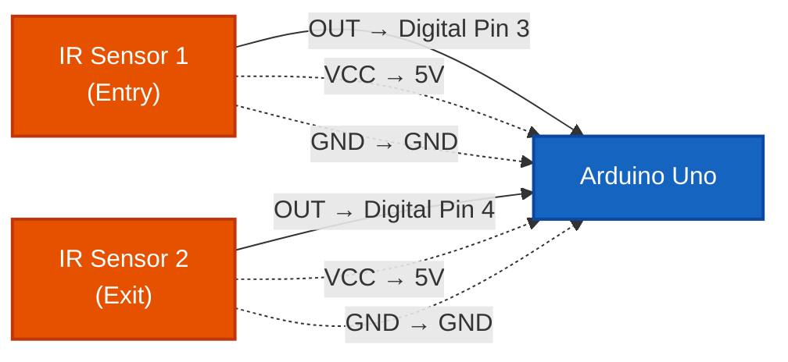
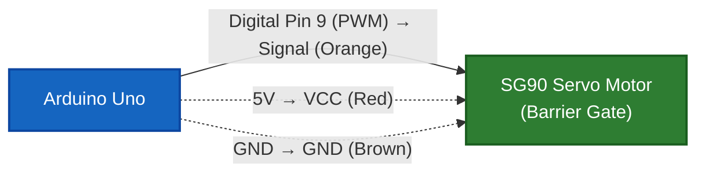
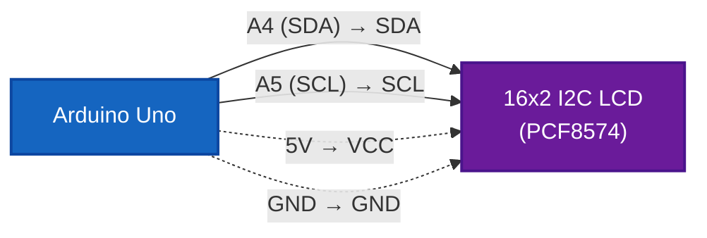
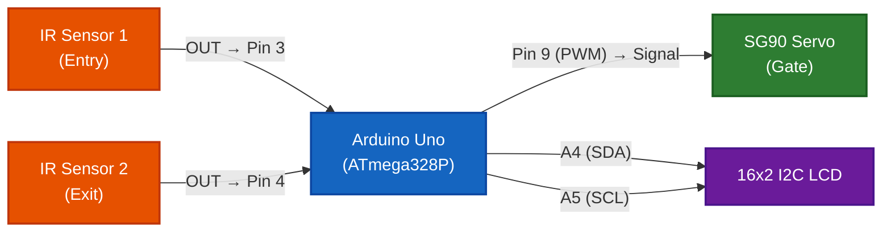
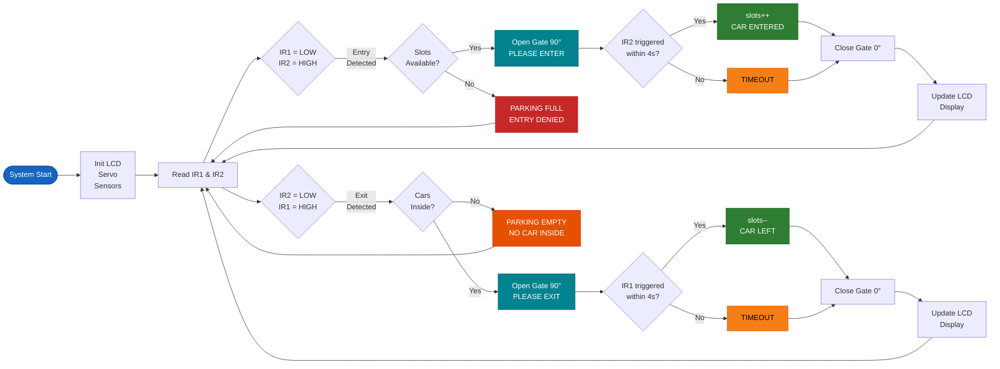

# 🚗 Smart Car Parking System

### By [SMB Robotics](https://github.com/shahidRafiq407)

> An Arduino-based automated car parking system using **2 IR Sensors**, a **Servo Motor** (barrier gate), and a **16x2 I2C LCD Display** to manage vehicle entry/exit and track available parking slots in real-time.


---

## 📋 Table of Contents

- [Features](#-features)
- [Components Required](#-components-required)
- [Circuit Diagram](#-circuit-diagram)
- [Pin Connections](#-pin-connections)
- [How It Works](#-how-it-works)
- [Installation & Upload](#-installation--upload)
- [Libraries Required](#-libraries-required)
- [Serial Monitor Output](#-serial-monitor-output)
- [Customization](#-customization)


---

## Features

| Feature | Description |
|---------|-------------|
| **Automatic Gate Control** | Servo-driven barrier opens/closes on vehicle detection |
| **Dual IR Sensor Detection** | Entry & Exit detection using 2 separate IR sensors |
| **Real-Time Slot Tracking** | Tracks occupied & available slots (configurable up to N slots) |
| **LCD Status Display** | 16x2 I2C LCD shows live parking status |
| **Parking Full Alert** | Denies entry when all slots are occupied |
| **Timeout Protection** | Auto-closes gate if vehicle doesn't cross within 4 seconds |
| **Serial Monitor Logging** | Full debug output via Serial Monitor at 9600 baud |

---

## 🧰 Components Required

| # | Component | Quantity | Description |
|---|-----------|----------|-------------|
| 1 | Arduino Uno | 1 | Microcontroller board |
| 2 | IR Sensor Module | 2 | FC-51 / obstacle avoidance module |
| 3 | SG90 Servo Motor | 1 | 9g micro servo for barrier gate |
| 4 | 16x2 LCD Display (I2C) | 1 | With PCF8574 I2C backpack |
| 5 | Jumper Wires | ~15 | Male-to-Female, Male-to-Male |
| 6 | Breadboard | 1 | Optional, for prototyping |
| 7 | USB Cable (Type-B) | 1 | For Arduino programming |
| 8 | Cardboard / Foam Board | 1 | For parking lot model |

---

## 🔌 Circuit Diagram

### Zone 1 — Sensor Inputs (IR Sensors → Arduino)



### Zone 2 — Actuator Output (Arduino → Servo Gate)



### Zone 3 — Display Output (Arduino → LCD via I2C)



### Full System Overview



> **Note:** All components share common **5V** and **GND** rails from the Arduino Uno.

---

### System Flow — Entry & Exit Logic



---

## 📌 Pin Connections

### IR Sensor 1 (Entry)

| IR Sensor 1 Pin | Arduino Pin |
|-----------------|-------------|
| VCC | 5V |
| GND | GND |
| OUT | Digital Pin 3 |

### IR Sensor 2 (Exit)

| IR Sensor 2 Pin | Arduino Pin |
|-----------------|-------------|
| VCC | 5V |
| GND | GND |
| OUT | Digital Pin 4 |

### SG90 Servo Motor (Gate)

| Servo Wire | Arduino Pin |
|------------|-------------|
| Red (VCC) | 5V |
| Brown (GND) | GND |
| Orange (Signal) | Digital Pin 9 |

### 16x2 I2C LCD Display

| LCD Pin | Arduino Pin |
|---------|-------------|
| VCC | 5V |
| GND | GND |
| SDA | A4 |
| SCL | A5 |

> **Note:** If your LCD doesn't show anything, try changing the I2C address from `0x27` to `0x3F` in the code.

---

## ⚙️ How It Works

### Entry Process
1. **Vehicle approaches** → IR Sensor 1 (Pin 3) detects the car (`LOW` signal)
2. System checks if parking slots are **available**
3. If available → **Servo opens gate** to 90° and LCD shows `PLEASE ENTER`
4. System waits **4 seconds** for IR Sensor 2 (Pin 4) to trigger (vehicle crossed)
5. If crossed → `occupiedSlots++`, LCD shows `CAR ENTERED SUCCESSFULLY`
6. If not crossed (timeout) → LCD shows `TIMEOUT / CANCEL`
7. Gate closes back to 0° and LCD updates slot count

### Exit Process
1. **Vehicle approaches from inside** → IR Sensor 2 (Pin 4) detects the car (`LOW` signal)
2. System checks if there are **cars inside** (`occupiedSlots > 0`)
3. If yes → **Servo opens gate** to 90° and LCD shows `PLEASE EXIT`
4. System waits **4 seconds** for IR Sensor 1 (Pin 3) to trigger (vehicle crossed)
5. If crossed → `occupiedSlots--`, LCD shows `CAR LEFT SUCCESSFULLY`
6. If not crossed (timeout) → LCD shows `TIMEOUT / CANCEL`
7. Gate closes back to 0° and LCD updates slot count

### Special Cases
- **Parking Full** → Entry denied, LCD shows `PARKING FULL - ENTRY DENIED`
- **Parking Empty** → Exit denied, LCD shows `PARKING EMPTY - NO CAR INSIDE`

---

## Installation & Upload

### Prerequisites
- [Arduino IDE](https://www.arduino.cc/en/software) (v1.8+ or v2.x)
- USB Type-B cable for Arduino Uno

### Steps

1. **Clone this repository**
   ```bash
   git clone https://github.com/shahidrafiq407/smart-car-parking-system.git
   cd smart-car-parking-system
   ```

2. **Install required libraries** (see [Libraries Required](#-libraries-required))

3. **Open the sketch**
   ```
   Open car_parking_system/car_parking_system.ino in Arduino IDE
   ```

4. **Select Board & Port**
   - Board: `Arduino Uno`
   - Port: Select the correct COM port

5. **Upload** → Click the Upload button (→)

6. **Open Serial Monitor** at `9600` baud to see live logs

---

## 📚 Libraries Required

| Library | Install via Arduino IDE |
|---------|------------------------|
| `Servo.h` | ✅ Built-in (no install needed) |
| `Wire.h` | ✅ Built-in (no install needed) |
| `LiquidCrystal_I2C.h` | Install from Library Manager → Search "LiquidCrystal I2C" by Frank de Brabander |

### Installing LiquidCrystal_I2C
1. Open Arduino IDE
2. Go to **Sketch** → **Include Library** → **Manage Libraries**
3. Search for `LiquidCrystal I2C`
4. Install the one by **Frank de Brabander**

---

## Serial Monitor Output

```
--- SMART PARKING SYSTEM READY ---
Total Slots: 4 | Occupied: 0 | Remaining Slots: 4
-------------------------------------------

[ENTRY] First Detection at D3 -> Gate Open!
[SUCCESS] Car Entered successfully!
Total Slots: 4 | Occupied: 1 | Remaining Slots: 3
-------------------------------------------

[EXIT] First Detection at D4 -> Gate Open!
[SUCCESS] Car Left successfully!
Total Slots: 4 | Occupied: 0 | Remaining Slots: 4
-------------------------------------------

[ALERT] Parking FULL! Entry Denied.
```

---

## Customization

| Parameter | Default | Location | Description |
|-----------|---------|----------|-------------|
| `totalSlots` | `4` | Line 14 | Total number of parking slots |
| `irSensor1` | `3` | Line 6 | Entry IR sensor pin |
| `irSensor2` | `4` | Line 7 | Exit IR sensor pin |
| `servoPin` | `9` | Line 8 | Servo motor pin |
| LCD I2C Address | `0x27` | Line 12 | Change to `0x3F` if LCD doesn't work |
| Gate open angle | `90°` | Lines 57, 118 | Servo angle when gate is open |
| Timeout duration | `4000ms` | Lines 63, 124 | Time to wait for vehicle to cross |


---

---

## 👨‍💻 Author

**SMB Robotics**
- Linkedin: [@SMBRobotics](https://www.linkedin.com/in/shahid407)
- Facebook: [@SMBRobotics](https://web.facebook.com/smbrobotics)
- instagram: [@SMBRobotics](https://www.instagram.com/smbrobotics)
- Reddit: [@SMBRobotics](https://www.reddit.com/user/SMB_ROBOTICS)
- youtube: [@SMBRobotics](https://youtube.com/shahidrafiq407)

Made with ❤️ by **SMB Robotics** — Building smart solutions with Arduino & Robotics.

---

> ⭐ If you found this project helpful, please give it a star!
